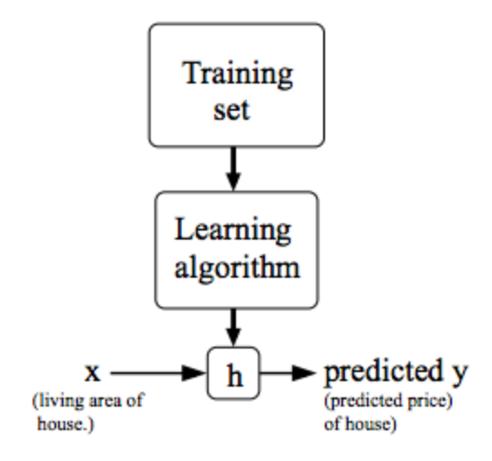
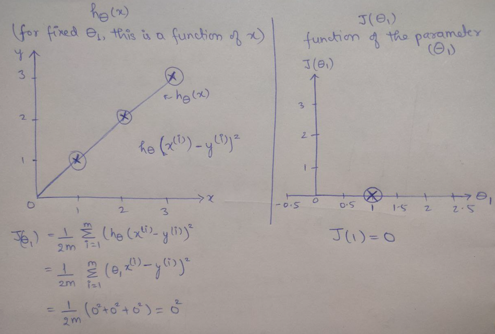
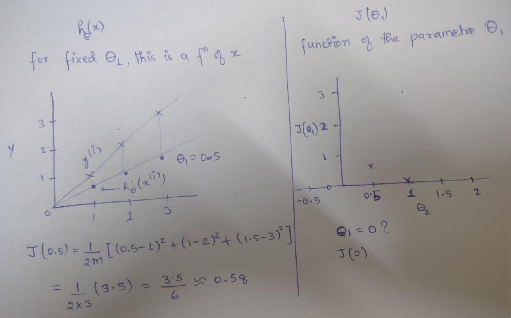
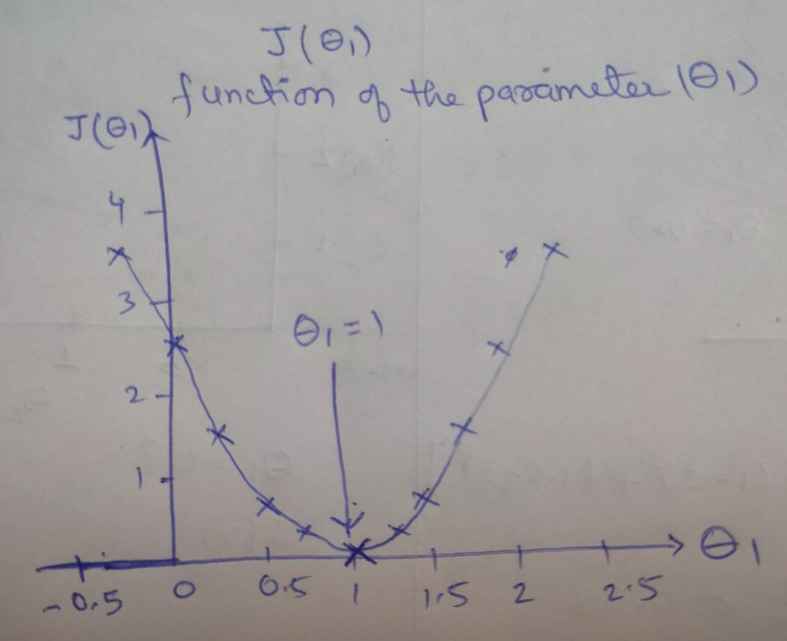
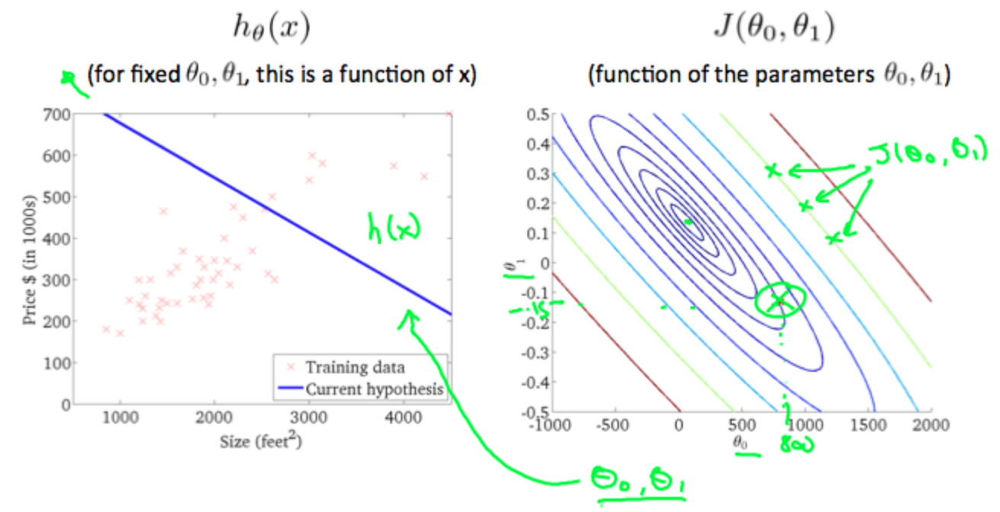
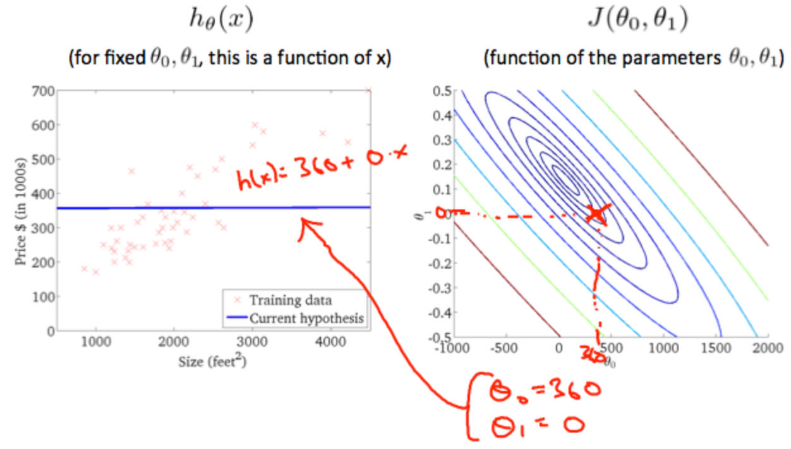
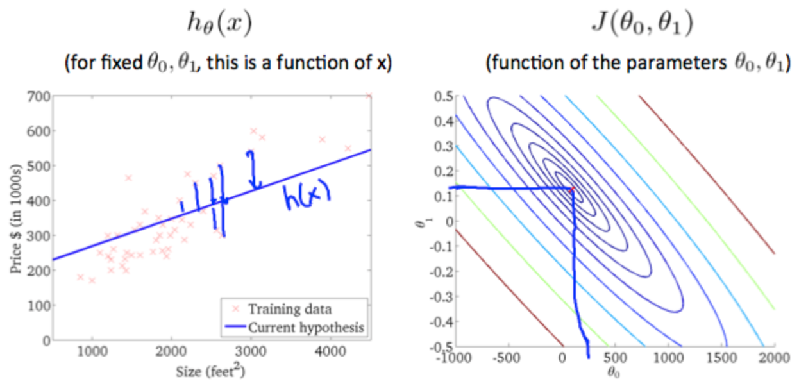
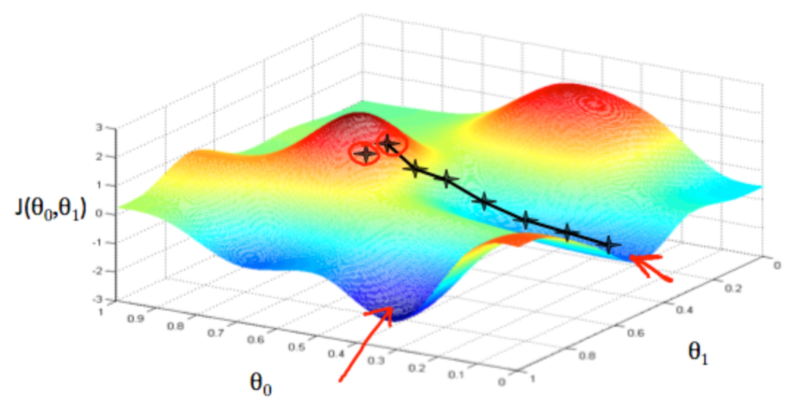

# Machine Learning by Stanford University - Coursera

## Week 1

### **What is Machine Learning?**
1. Definition by Sir Arthur Samuel -
> Machine Learning is the field of study that gives the computers the ability to learn without being explicitly programmed for it.

2. Definition by Sir Tom Mitchel -
> A computer program is said to learn from *experience E* with some class of *tasks T* and *performance measure P*, if its performance at tasks **T**, as measured by **P**, improves with experience **E**.

Example of Playing Checkers:
- **E =** the experience of playing many games of checkers
- **T =** the task of playing checkers
- **P =** the probability of winning the game

---

### **What is Supervised Machine Learning?**
In supervised learning, we have both input and correct output corresponding to that input and all we need to do is to find a relation function (relationship) between the input and output.

*There are two types of Supervised Machine Learning -*
1. *Classification*
2. *Regression*

**Classification:**
> In such problems, we try to predict results in discrete values. We try to map input variables to discrete categories. Example:

- Predicting whether the patient's tumor is malignant or benign giving his/her tumor information as input.
- Predicting whether the house will be sold for more or less than the asking price given the data of real estate market and information about the house.

**Regression:**
> In such problems, we try to predict results in continuous values. We try to map input variables to continuous functions. Example:

- Predicting age of the person by giving his/her picture as input.
- Predicting price of a house given the size of house in real estate market as input.

---

### **What is Unsupervised Machine Learning?**
In Unsupervised learning, it allows us to approach problems with little or no knowledge about the result or outcomes. We can derive structure from data where we don't necessarily know the effect of the variables. Example:

*There are two types of Unsupervised Machine Learning -*
1. *Clustering*
2. *Non-Clustering*

**Clustering:**
> It is the process of grouping together similar entities that are related to each other in similar way.

- In a collection of a million genes, we find a way to automatically group together those genes which are related to each other in terms of either life span, location, roles, etc.

**Non-Clustering:**
> It is the process, unlike clustering, rather than grouping together related entities, we transform the data/input to get results.

- In a party, we need to identify individual voices and music from a mesh of sounds in the party.

---

### **Model Representation**
- x(i) will denote input variables (also called *input features*).
- y(i) will denote output variables (also called *target variables*) that we are trying to predict.

- **Training Data**
: A pair of (x(i), y(i)) is called a training example or training data.

- **Training Set**
: A set of **m** training examples is called a training set.

**Formal Description for supervised learning:**
Given a training set, we need to find a function **h: X --> Y** such that **h(X)** is a good predictor for the corresponding value of Y. This function h is called *"HYPOTHESIS"*.

**NOTE:** When the target variable y (which we are trying to predict) gives continuous values, we call it *regression problem*. On the other hand, when it gives discrete values, we call it *classification problem*.

### **Cost Function:**
> It is used for measuring the accuracy of the Hypothesis. Here, we take average difference of all the results of hypothesis from input X to output Y.

> The main idea behind is to chose such a hypothesis that predicted value is as close to the actual value as it can be.

where
- **J(Θ0, Θ1)** is Cost Function.
- **m** is total number of training examples or size of training set.
- **i** is index of training example.
- **hΘ(x(i))** is the predicted value by the hypothesis *h* on input *x(i)*.
- **yi** is the actual output that should have been received.

> This function is also called 'SQUARED ERROR FUNCTION' or 'MEAN SQUARED FUNCTION' because the mean is halved for the convenience of computing the gradient descent. This half (1/2) value will be cancelled out by the derivative term of square function.

#### **Cost Function Intuition - 1:**
Assume the training data set on a X-Y plane. We try to make a straight line that will pass through all the scattered data points (hΘ(x)). We will get the *best possible line* when the average squared vertical distances of the scattered points from the line will be *LEAST*.

> Ideally the straight line should pass through all the scattered data points (J(Θ0, Θ1) = 0).

When we set **Θ1 = 1**, we get a slope of 1 which passes though each and every data point in the model.
When we set **Θ1 = 0.5**, we get to see that the vertical distance of the data points from the line increases.

This increases the cost function to **0.58**. If we plot several other graphs we get the following graph:

Since the goal was to **minimize the cost function**, Θ1 = 1 becomes the *global minimum*.

#### **Cost Function Intuition - 2:**
**Contour Plot**
: It is a graph that contains many contour lines. A contour line of a two variable function has a constant value at all points of the same line.

1. *Example 1:*

Picking any coloured line in the graph above, we can expect same values of the cost function along that coloured line. Example -
- The 3 green points marked on the green line will yield the same value for J(Θ0, Θ1). Hence, they are found on the same green line.
- The circled X in the right graph above shows the value of the cost function for the left graph when Θ0 = 800 and Θ1 = -0.15.

2. *Example 2:*

- Let us assume that Θ0 = 360 and Θ1 = 0, then the value of J(Θ0, Θ1) in the contour plot gets closer to the center. This reduces the cost function error.
- When we give the hypothesis function a slightly positive slope will result in a better fit of the data as shown in the graphs below:

- As we can see, the graph minimizes the cost function as much as possible. As a result, the value of Θ1 and Θ0 tend to be 0.12 and 250 approximately, respectively.
- When we plot those values on the graph, the right ones seems to put the point in the center of the inner most *circle*.

---

### **Gradient Descent:**
After having a hypothesis function and a method of measuring how well the data fits into it, we need to find the parameters of the hypothesis function. Assume a graph with cost function as the parameter estimates and *x* and *y* themselves are not being graphed but instead the *parameter range* of the hypothesis function and *cost* resulting from selecting a particular set of parameters are graphed.

We put **Θ0** on the X-axis, **Θ1** on the Y-axis and the **Cost Function** on the z-axis. In this graph, the points will be the result of the cost function using the hypothesis with those specific theta parameters.

- The success is achieved when the cost function is at the very bottom of the pits of the graph, that is, when its value is minimum. In the graph above, the red arrows show the minimum point in graph.
