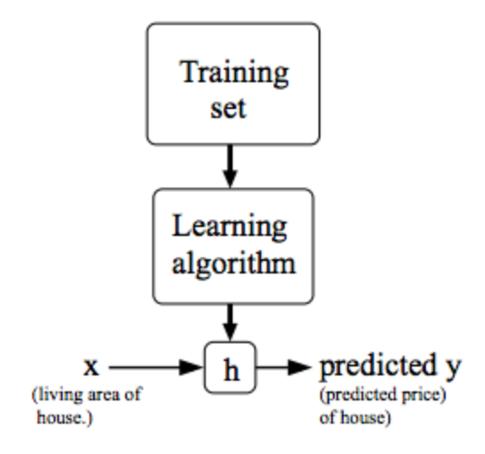

# Machine Learning by Stanford University - Coursera

## Week 1

### **What is Machine Learning?**
1. Definition by Sir Arthur Samuel -
> Machine Learning is the field of study that gives the computers the ability to learn without being explicitly programmed for it.

2. Definition by Sir Tom Mitchel -
> A computer program is said to learn from *experience E* with some class of *tasks T* and *performance measure P*, if its performance at tasks **T**, as measured by **P**, improves with experience **E**.

Example of Playing Checkers:
- **E =** the experience of playing many games of checkers
- **T =** the task of playing checkers
- **P =** the probability of winning the game

---

### **What is Supervised Machine Learning?**
In supervised learning, we have both input and correct output corresponding to that input and all we need to do is to find a relation function (relationship) between the input and output.

*There are two types of Supervised Machine Learning -*
1. *Classification*
2. *Regression*

**Classification:**
> In such problems, we try to predict results in discrete values. We try to map input variables to discrete categories. Example:

- Predicting whether the patient's tumor is malignant or benign giving his/her tumor information as input.
- Predicting whether the house will be sold for more or less than the asking price given the data of real estate market and information about the house.

**Regression:**
> In such problems, we try to predict results in continuous values. We try to map input variables to continuous functions. Example:

- Predicting age of the person by giving his/her picture as input.
- Predicting price of a house given the size of house in real estate market as input.

---

### **What is Unsupervised Machine Learning?**
In Unsupervised learning, it allows us to approach problems with little or no knowledge about the result or outcomes. We can derive structure from data where we don't necessarily know the effect of the variables. Example:

*There are two types of Unsupervised Machine Learning -*
1. *Clustering*
2. *Non-Clustering*

**Clustering:**
> It is the process of grouping together similar entities that are related to each other in similar way.

- In a collection of a million genes, we find a way to automatically group together those genes which are related to each other in terms of either life span, location, roles, etc.

**Non-Clustering:**
> It is the process, unlike clustering, rather than grouping together related entities, we transform the data/input to get results.

- In a party, we need to identify individual voices and music from a mesh of sounds in the party.

---

### **Model Representation**
- x^(i)^ will denote input variables (also called *input features*).
- y^(i)^ will denote output variables (also called *target variables*) that we are trying to predict.

- **Training Data**
: A pair of (x^(i)^, y^(i)^) is called a training example or training data.

- **Training Set**
: A set of **m** training examples is called a training set.

**Formal Description for supervised learning:**
Given a training set, we need to find a function **h: X --> Y** such that **h(X)** is a good predictor for the corresponding value of Y. This function h is called *"HYPOTHESIS"*.

**NOTE:** When the target variable y (which we are trying to predict) gives continuous values, we call it *regression problem*. On the other hand, when it gives discrete values, we call it *classification problem*.

### **Cost Function:**
> It is used for measuring the accuracy of the Hypothesis. Here, we take average difference of all the results of hypothesis from input X to output Y.

J(Θ0, Θ1) =
